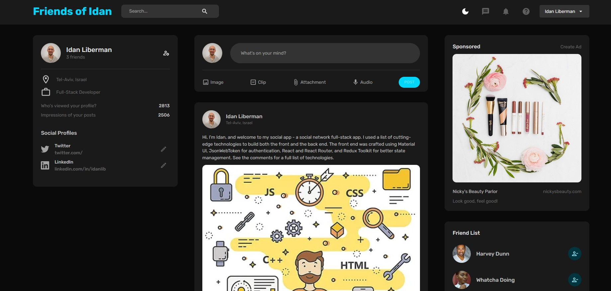

<h1 align="center">Hello! I'm Idan 🐋 ✨ </h1>

I'm a **full-stack developer** with substantial background in **C**, **Java**, **JavaScript** and various full-stack technologies (list below). Boasting deep familiarity with OOP principles and some sweet projects to my name.

### Added-Value Skills and Tools

- 🖥 ️A **Full-Stack developer** in **Javascript**, **React**, **Bootstrap**, and other tools.
- 🍎 **Object-Oriented Programming** and **Java**.
- ©️ Experience (and much love for) **C**.
- 🤖 **Data structures and algorithms** - Nothing works without them!
- 🔤 An **English-Language Expert**, with a **Master's Degree** in English and American Studies.
- 🎙️ A **musician**, **songwriter**, and **singer.**
- 🔍 I’m looking to collaborate on front-end development, music technology, and contribute to open source projects.
- 💬 Ask me about Front-End Development, music technology, anything cool

<h2 align="center"><u>Some of My Projects</u></h2>

<h3>🤝 Friends of Idan: A Social Network App</h3>

 

A complete MERN app, incl. registration, authentication, and tons of social features.
 

[Live Demo!](https://friendsofidan.onrender.com/) 
[Front-End Repo here](https://github.com/IdanLib/IdanSocialApp-front-end/) 
[Back-End Repo here](https://github.com/IdanLib/IdanSocialApp-back-end/) 

---

<h3>❓ Quizzical: A Trivia App</h3>

 

Built in React.js, with selectable category and difficulty level. Many minutes of fun!
 

[Live Demo!](https://idanlquizzical.netlify.app/) 
[Repo here](https://github.com/IdanLib/Quizzical-a-trivia-app-react/) 

---

<h3>🥁 The Ding-a-Ling 3000 Drum Machine</h3>

 

The Ding-a-ling 3000 is a web-based drum machine. Jam alone or with your friends! 
--> **Added MIDI support on Google Chrome!** <-- 
Built in Javascript (ES6).

[Live Demo!](https://idanldrummachine.netlify.app/) 
[Repo here](https://github.com/IdanLib/drum-machine/) 

---

<h3>👓 Markdown Previewer</h3>

 
A live preview of your markdown code!

[Live Demo!](https://idanlmdpreview.netlify.app/) 
[Repo here](https://github.com/IdanLib/markdown-previewer/)
 

---

<h3>⏰ Customizable Pomodoro Timer</h3>

 
A productivity tool: A customizable, alternating work-break timer.

[Live Demo!](https://idanlpomodorotimer.netlify.app/) 
[Repo here](https://github.com/IdanLib/pomodoro-timer/)
 

---

<h3>📚 Random Quote Machine</h3>

  
A randomized piece of wisdom from access time and space. Built with React.js.

[Live Demo!](https://idanlrandomquotegen.netlify.app/) 
[Repo here](https://github.com/IdanLib/random-quote-generator-react)
 

---

<h3>🔧 Node.js/ Express.js Projects</h3>

Various node.js projects - services for the rest of us!

1.  <h4>URL Shortener</h4>

        [Repo here](https://github.com/IdanLib/url-shortener/)

     

2.  <h4>Exercise Tracker</h4>

        [Repo here](https://github.com/IdanLib/exercise-tracker)

     

### Connect with Me

 
