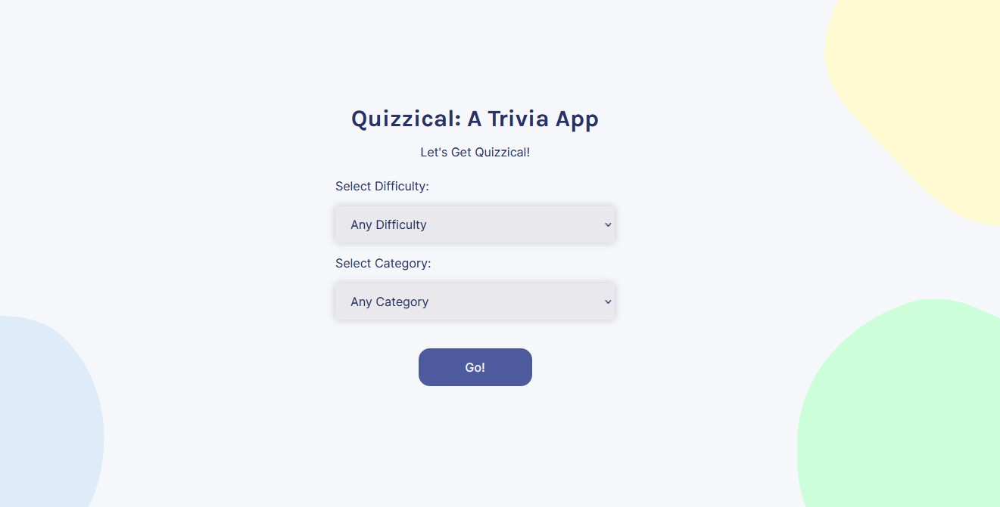
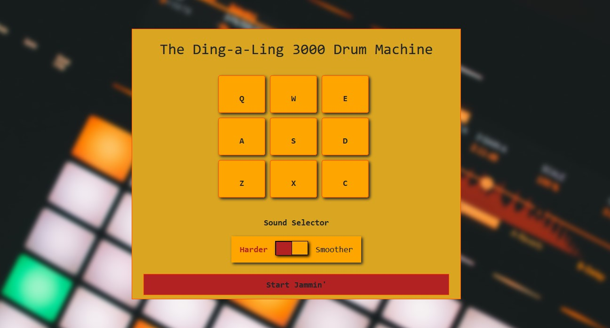
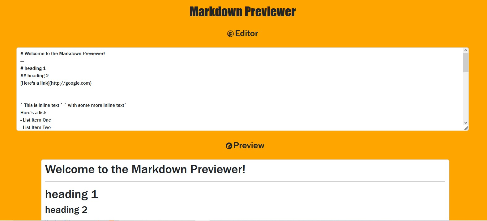
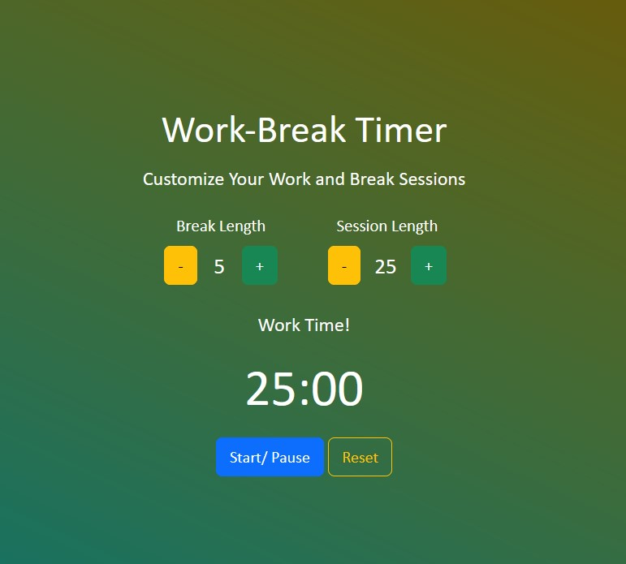
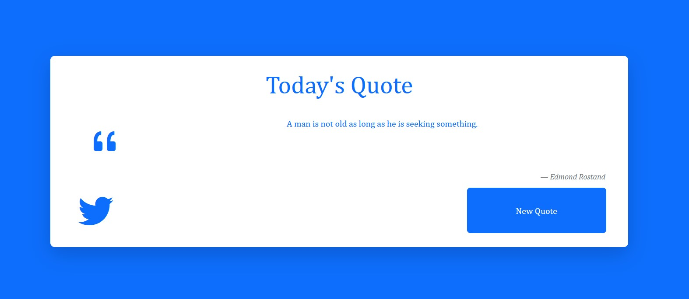

<h1 align="center">Hello! I'm Idan 🐋 ✨ </h1>

I'm a **full-stack developer** with substantial background in **C**, **Java**, **JavaScript** and various full-stack technologies (list below). Boasting deep familiarity with OOP principles and some sweet projects to my name. 

_Fun fact_: I am also an **English-language expert** (with an M.A. in English), as well as a **singer and musician**.

- 🖥 ️A **Full-Stack developer** in **Javascript**, **React**, **Bootstrap**, and other tools.
- 🍎 **Object-Oriented Programming** and **Java**. 
- ©️ Experience (and much love for) **C**.
- 🤖 **Data structures and algorithms** - Nothing works without them!
- 🔤 An **English-Language Expert**, with a **Master's Degree** in English and American Studies.
- 🎙️ A **musician**, **songwriter**, and **singer.** 
- 🔍 I’m looking to collaborate on front-end development, music technology, and contribute to open source projects.
- 💬 Ask me about Front-End Development, music technology, anything cool 

<h2 align="center"><u>Some of My Projects</u></h2>

<h3>❓ Quizzical: A Trivia App</h3>

 

Built in React.js, with selectable category and difficulty level. Many minutes of fun!
 

[Live Demo!](https://idanlquizzical.netlify.app/) 
[Repo here](https://github.com/IdanLib/Quizzical-a-trivia-app-react/) 

---------------------

<h3>🥁 The Ding-a-Ling 3000 Drum Machine</h3>

 

The Ding-a-ling 3000 is a web-based drum machine. Jam alone or with your friends!  
--> **Added MIDI support on Google Chrome!** <--  
Built in React.js with Vite.

[Live Demo!](https://idanldrummachine2.netlify.app/) 
[Repo here](https://github.com/IdanLib/drum-machine-react) 
 

----------------

<h3>👓 Markdown Previewer</h3>

 
A live preview of your markdown code! 

[Live Demo!](https://idanlmdpreview.netlify.app/) 
[Repo here](https://github.com/IdanLib/markdown-previewer/)
 

----------------

<h3>⏰ Customizable Pomodoro Timer</h3>

 
A productivity tool: A customizable, alternating work-break timer.

[Live Demo!](https://idanlpomodorotimer.netlify.app/) 
[Repo here](https://github.com/IdanLib/pomodoro-timer/)
 

---------

<h3>📚 Random Quote Machine</h3>

  
A randomized piece of wisdom from access time and space. Built with React.js. 

[Live Demo!](https://idanlrandomquotegen.netlify.app/) 
[Repo here](https://github.com/IdanLib/random-quote-generator-react)
 

---------
<h3>🔧 Node.js/ Express.js Projects</h3>

Various node.js projects - services for the rest of us! 

1. <h4>URL Shortener</h4>

    [Repo here](https://github.com/IdanLib/url-shortener/)
 

2. <h4>Exercise Tracker</h4>

    [Repo here](https://github.com/IdanLib/exercise-tracker)
 

3. <h4>Request Head Parser</h4>

    [Repo here](https://github.com/IdanLib/request-head-parser) 

### Languages and Tools

 
 

 

### Connect with me:

 
